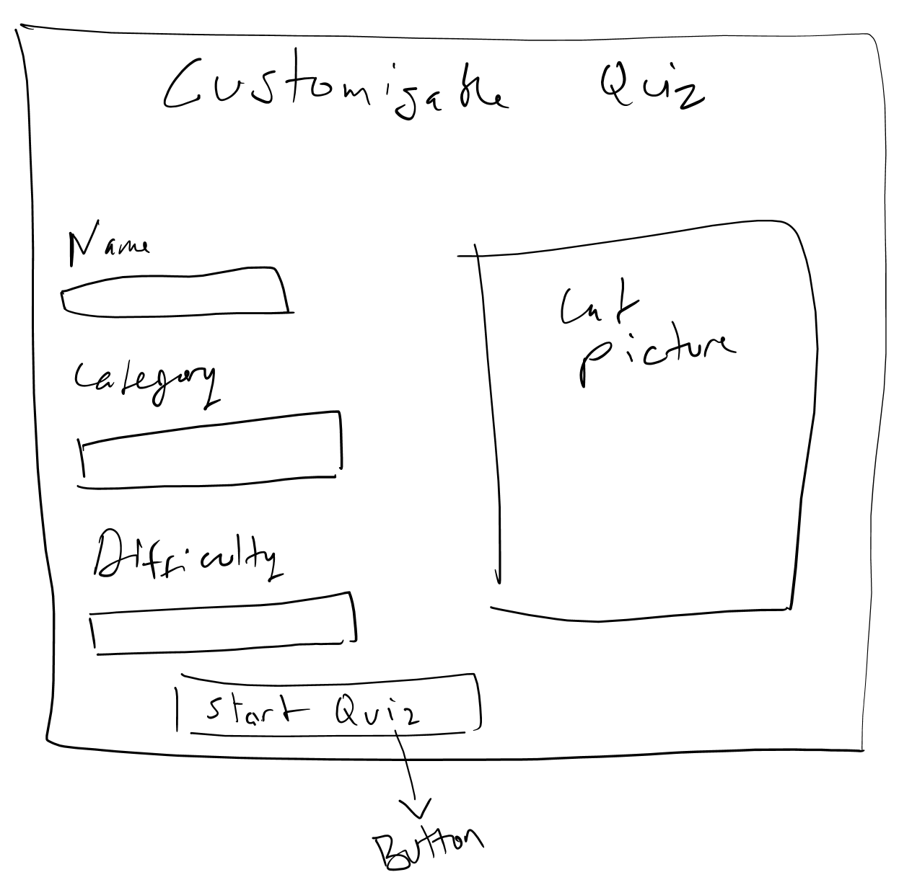
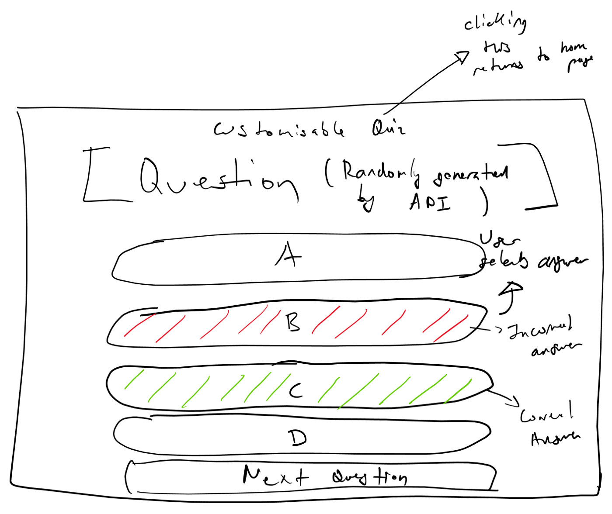
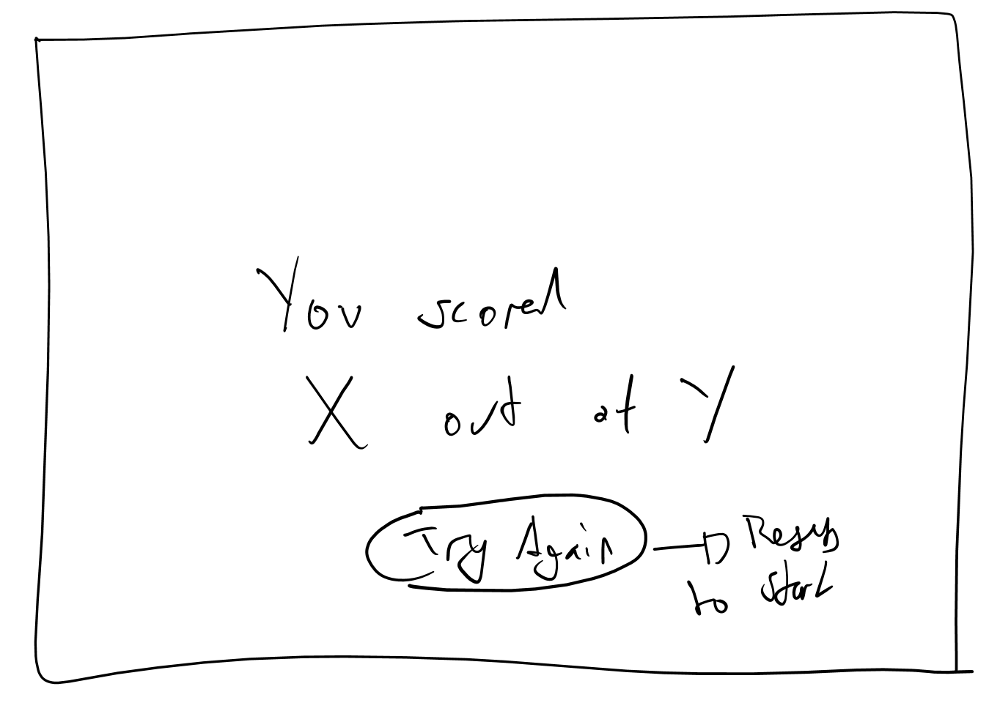
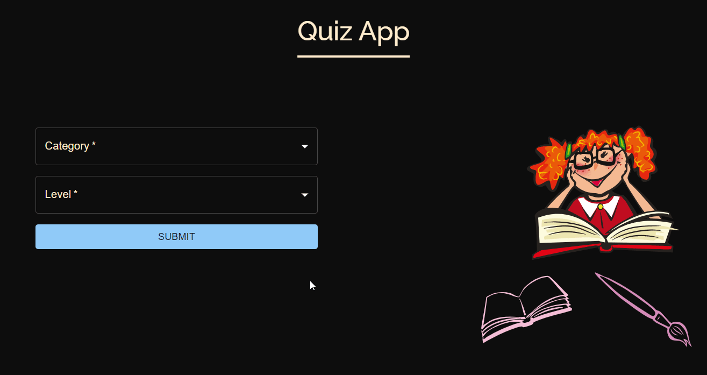

# Technology used

HTML, CSS, JavaScript, React.js,React-Hooks, React-Router-dom v6, Grid System of Bootstrap, Material UI 

### What are the scenarios
:ballot_box_with_check:Here are the scenarios -
When the user clicks a button, the next question should show

If the user gets the question correct, it should increment their 

After click automatic new question should appear

Show clicked ans was correct or incorrect 

When the user gets to the end of the quiz, their total score should be shown

Our first goal is to take the question data from the array, and display it on the screen

## Here it is :100:

### What i have learned

#### :black_nib:Interactions with Material UI and key JavaScript methods.
#### :black_nib:Working with user events and state to create interactive applications.
#### :black_nib:How to shuffle array to mix correct option with incorrect option.
#### :black_nib:React Hooks (in-depth)! ex. useSelector , useState, useEffect, useDispatch etc.
#### :black_nib:Class-based components and functional components.
#### :black_nib:Various HTML and CSS elements along with Basic JavaScript and modern ES6 practices used in building a functional and responsive quiz App, as shown in the Gif above
#### :black_nib:Routing with React Router.
#### :black_nib:How to use Grid System of Bootstrap or React-Bootstrap
#### :black_nib:Amazing things and learning a lot along on the way.

